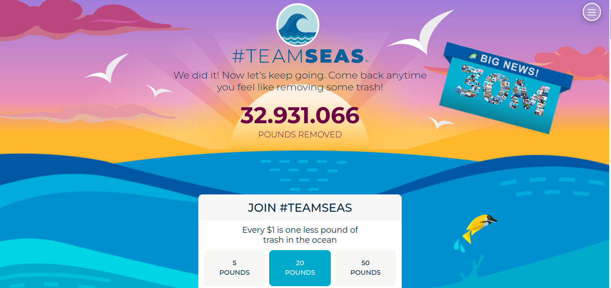

  

  <a href="#-tecnologias">Tecnologias</a>&nbsp;&nbsp;&nbsp;|&nbsp;&nbsp;&nbsp;
  <a href="#-projeto">Projeto</a>&nbsp;&nbsp;&nbsp;|&nbsp;&nbsp;&nbsp;
  <a href="#-como-executar">Como executar</a>&nbsp;&nbsp;&nbsp;|&nbsp;&nbsp;&nbsp;
  <a href="#-licença">Licença</a>

  

 

## ✨ Tecnologias

Esse projeto foi desenvolvido com as seguintes tecnologias:

## 💻 Projeto

Esse projeto é uma tentativa de fazer o frontend do [TeamSeas](https://teamseas.org/) com as tecnologias mencionadas.

  

## 🚀 Como executar

### 💻 Pré-requisitos

Antes de começar, verifique se você atendeu aos seguintes requisitos:

- Você instalou a versão mais recente de `< Docker & Node>`
- Você tem uma máquina `< Windows / Linux / Mac >`.
- Você possui um `< Editor de código ou IDE / Gerenciador de banco de dados >`.

### Se lembre de ter o Docker rodando :ocean:

E então, rode o comando `docker-compose up --build -V`.

Agora você pode acessar [localhost:8000/graphql](http://localhost:3000) do seu navegador.

## 📄 Licença

Esse projeto está sob a licença MIT. Veja o arquivo [LICENSE](../LICENSE.md) para mais detalhes.

---

#### _Sinta-se livre para colaborar, toda ajuda é bem vinda ;)_
